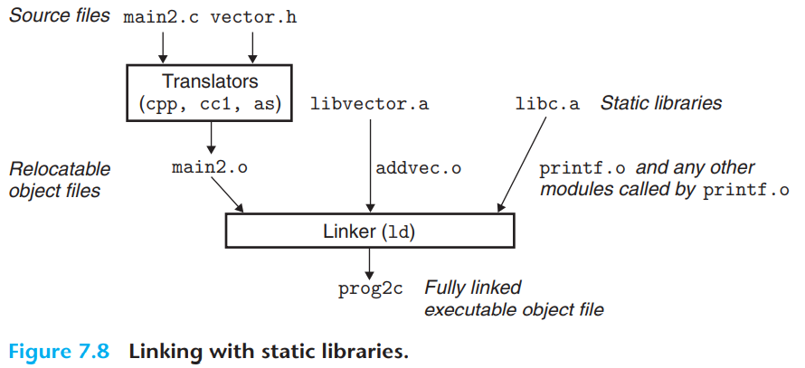

# linking
Linking is the process of collecting and combining various pieces of code and data into a single file that can be loaded (copied) into memory and executed

Linking can be performed at
1.  complie time: when the source code is translated into machine code;
2.  load time: when the source code is translated into machine code;
3.  run time: by application programs

On modern systems, linking is performed automatically by programs called linkers.

## Compile Divers
Most compilation systems provide a compiler driver that invokes the language preprocessor, compiler, assembler, and linker, as needed on behalf of the user.


## static linking

Static linkers such as the Linux `LD` program take as input a collection of relocatable object files and command-line arguments and generate as output a fully linked executable object file that can be loaded and run.

 Instructions are in one section, initialized global variables are in another section, and uninitialized variables are in yet another section.

To build the executable, the linker must perform two main tasks:

1. **Symbol resolution**: The purpose of symbol resolution is to associate each symbol reference with exactly one symbol definition.
2. **Relocation**: Compilers and assemblers generate code and data sections that **start at address 0**. The linker **relocates these sections** by associating a memory location with each symbol definition, and then modifying all of the references to those symbols so that they point to this memory location

## object files

Object files come in three forms:

1. Relocatable object file. Contains binary code and data in a form that can be combined with other relocatable object files at compile time to create an executable object file
2. Executable object file. Contains binary code and data in a form that can be copied directly into memory and executed
3. Shared object file. A special type of relocatable object file that can be loaded into memory and linked dynamically, at either load time or run time.


Compilers and assemblers generate **relocatable** object files (including shared object files). Linkers generate **executable** object files. 


Technically, an **object module** is a sequence of bytes, and an **object file** is an object module stored on disk in a file. However, we will use these terms interchangeably


## Relocatable Object Files

 the format of a typical ELF relocatable object file


- The ELF **header** begins with a 16-byte sequence that describes the **word size** and **byte ordering** of the system that generated the file. The rest of the ELF header contains information that allows a linker to **parse** and **interpret** the object file. This includes the **size of the ELF header**, the **object file type** (e.g., relocatable, executable, or shared), the **machine type** (e.g., x86-64), the **file offset** of the section header table, and the **size and number of entries** in the section header table
- `.text`: The **machine code** of the compiled program
- `.rodata`: Read-only data such as the format strings in `printf` statements, and jump tables for switch statements
- `.data` **Initialized global and static C variables**. Local C variables are maintained at run time on the stack and do not appear in either the `.data` or `.bss` sections.
- `.bss` **Uninitialized global and static C variables**, along with any global or static variables that are initialized to zero. This section occupies **no actual space** in the object file; it is merely a **placeholder**. Object file formats distinguish between initialized and uninitialized variables for **space efficiency**: uninitialized variables do **not have to occupy any actual disk space in the object file**. At run time, these variables are allocated in memory **with an initial value of zero**
- `.symtab` A **symbol table** with information about functions and global variables that are **defined and referenced in the program**. Some programmers mistakenly believe that a program must be compiled with the -g option to get symbol table information. In fact, every relocatable object file has a symbol table in `.symtab` (unless the programmer has specifically removed it with the strip command). However, unlike the symbol table inside a compiler, the `.symtab` symbol table does not contain entries for local variables.
- `.rel.text` A list of locations in the `.text` section that will need to be `modified` when the linker combines this object file with others. In general, **any instruction that calls an external function or references a global variable will need to be modified**. On the other hand, instructions that call local functions do not need to be modified. **Note that relocation information is not needed in executable object files, and is usually omitted unless the user explicitly instructs the linker to include it**
- `.rel.data` Relocation information for any global variables that are referenced or defined by the module. In general, **any initialized global variable whose initial value is the address of a global variable or externally defined function will need to be modified.**
- `.debug` A **debugging symbol table** with entries for local variables and typedefs defined in the program, global variables defined and referenced in the program, and the original C source file. **It is only present if the compiler driver is invoked with the -g option.**
- `.line` A **mapping** between line numbers in the **original C source program** and **machine code instructions** in the `.text` section. It is only present if the compiler driver is invoked with the **-g option**.
- `.strtab` A **string table** for the symbol tables in the `.symtab` and `.debug` sections and for the section names in the section headers. A string table is **a sequence of null-terminated character strings.**

## Symbols and Symbol Tables


Each **relocatable object module**, m, has a symbol table that **contains information about the symbols that are defined and referenced by m**. In the context of a linker, there are three different kinds of symbols

1. **Global symbols** that are **defined by module m** and that can be referenced by other modules. Global linker symbols correspond to `nonstati`c C functions and global variables
2. **Global symbols** that are referenced by module m **but defined by some other module**. Such symbols are called **externals** and correspond to `nonstatic` C functions and global variables that are defined in other modules
3. **Local symbols** that are defined and referenced exclusively by module m. These correspond to static C functions and global variables that are defined with the static attribute.


Interestingly, **local** procedure variables that are defined with the **C static attribute are not managed on the stack**. Instead, the compiler allocates space in `.data` or `.bss` for each definition and creates a local linker symbol in the symbol table with **a unique name**.


An ELF symbol table is contained in the `.symtab` section. It contains an array of entries.

This shows the format of each entry.

```c
typedef struct {
	int name; 		/* String table offset */
	char type:4, 	/* Function or data (4 bits) */
		binding:4; 	/* Local or global (4 bits) */
	char reserved; 	/* Unused */
	short section; 	/* Section header index */
	long value; 	/* Section offset or absolute address */
	long size; 		/* Object size in bytes */
} Elf64_Symbol;
```

The `name` is a byte offset into the string table that points to the null-terminated string name of the symbol. The `value` is the symbol’s address. For **relocatable modules**, the `value` is **an offset from the beginning of the section where the object is defined**. For **executable object files**, the `value` is an **absolute run-time address**. The `size` is the size (in bytes) of the object. The `type` is usually either data or function. The `binding` field indicates **whether the symbol is local or global**.

Each symbol is assigned to some section of the object file, denoted by the `section` field, which is an `index` into the section header table. There are **three** special `pseudosections` that don’t have entries in the section header table

1. `ABS` is for symbols that should not be relocated.
2. `UNDEF` is for undefined symbols—that is, symbols that are referenced in this object module but defined elsewhere
3. `COMMON` is for uninitialized data objects that are not yet allocated

For `COMMON` symbols, the `value` field gives the alignment requirement, and `size` gives the minimum size. Note that these `pseudosections` exist only in relocatable object files; they do not exist in executable object files.

## Symbol Resolution


The linker resolves **symbol references** by **associating** each reference with **exactly one symbol definition** from the **symbol tables** of its input relocatable object files.


 When the compiler encounters a `symbol` (either a variable or function name) that is **not defined** in the current module, it **assumes that it is defined in some other module**, generates a linker **symbol table entry**, and leaves it **for the linker to handle**. If the linker is **unable to find a definition** for the referenced symbol in any of its input modules, it prints an (often cryptic) **error message** and terminates


Symbol resolution for **global symbols** is also tricky because **multiple object modules might define global symbols with the same name**. In this case, the linker must either **flag an error** or somehow **choose one of the definitions and discard the rest**.


### How Linkers Resolve Duplicate Symbol Names

At **compile** time, the compiler exports each global symbol to the assembler as either `strong` or `weak`, and the assembler encodes this information implicitly in the **symbol table of the relocatable object file**.  Functions and initialized global variables get strong symbols. Uninitialized global variables get weak symbols.

Given this notion of strong and weak symbols, Linux linkers use the following rules for dealing with duplicate symbol names:

1. Multiple strong symbols with the same name are not allowed.
2.  Given a strong symbol and multiple weak symbols with the same name, choose the strong symbol
3. Given multiple weak symbols with the same name, choose any of the weak symbols.

### Linking with Static Libraries

In practice, all compilation systems provide a mechanism for packaging related object modules into a single file called a static library, which can then be supplied as input to the linker

Consider the different approaches that compiler developers might use to provide these functions to users without the benefit of static libraries. One approach would be to have **the compiler recognize calls to the standard functions and to generate the appropriate code directly**，Another approach would be to **put all of the standard C functions in a single relocatable object module**, say, `libc.o`, that application programmers could link into their executables.

The first way isn't feasible for C because of **the large number of standard functions** defined by the C standard and the another is also not feasible because **every executable file in a system would now contain a complete copy of the collection of standard functions**, which would be extremely wasteful of disk space. Another big disadvantage is that **any change to any standard function**, no matter how small, would require the library developer to **recompile** the entire source file.


The notion of a static library was developed to resolve the disadvantages of these various approaches. **Related functions can be compiled into separate object modules and then packaged in a single static library file**

At link time, the **linker will only copy the object modules that are referenced by the program**, which reduces the size of the executable on disk and in memory. On the other hand, the application programmer **only needs to include the names of a few library files**.


On Linux systems, static libraries are stored on disk in a particular file format known as an **archive**. An archive is **a collection of concatenated relocatable object files**, with a header that describes the size and location of each member object file. Archive filenames are denoted with the .a suffix




### How Linkers Use Static Libraries to Resolve References

While static libraries are useful, they are also a source of confusion to programmers because of the way the Linux linker uses them to resolve **external references**.

During this scan, the linker maintains a set **E** of relocatable object files that will be merged to form the executable, a set **U** of unresolved symbols (i.e., symbols referred to but not yet defined), and a set **D** of symbols that have been defined in previous input files. Initially, E, U, and D are empty

- For each input file f on the command line, the linker determines if f is an object file or an archive. If f is an object file, the linker adds f to E, updates U and D to reflect the symbol definitions and references in f , and proceeds to the next input file.
- If f is an archive, the linker attempts to match the unresolved symbols in U against the symbols defined by the members of the archive. If some archive member m defines a symbol that resolves a reference in U, then m is added to E, and the linker updates U and D to reflect the symbol definitions and references in m. This process iterates over the member object files in the archive until a fixed point is reached where U and D no longer change. At this point, any member object files not contained in E are simply discarded and the linker proceeds to the next input file.
- If U is nonempty when the linker finishes scanning the input files on the command line, it prints an error and terminates. Otherwise, it merges and relocates the object files in E to build the output executable file.

Unfortunately, this algorithm can result in some **baffling link-time errors** because the **ordering** of libraries and object files on the command line is significant. **If the library that defines a symbol appears on the command line before the object file that references that symbol, then the reference will not be resolved and linking will fail**


The general rule for libraries is to **place them at the end of the command line**. If the members of the different libraries are independent, in that **no member references a symbol defined by another member**, then the libraries can be placed at the end of the command line **in any order**. If, on the other hand, the libraries are **not independent**, then they must be ordered so that for each symbols that is referenced externally by a member of an archive, at least one definition of s follows a reference to s on the command line.

For example, suppose `foo.c` calls functions in `libx.a` and `libz.a` that call functions in `liby.a`. Then `libx.a` and `libz.a` must precede `liby.a` on the command line:

```bash
gcc foo.c libx.a libz.a liby.a
```


Libraries can be **repeated** on the command line if necessary to satisfy the **dependence requirements**. For example, suppose `foo.c` calls a function in `libx.a` that calls a function in `liby.a` that calls a function in `libx.a`. Then `libx.a` must be repeated on the command line

```bash
gcc foo.c libx.a liby.a libx.a
```
